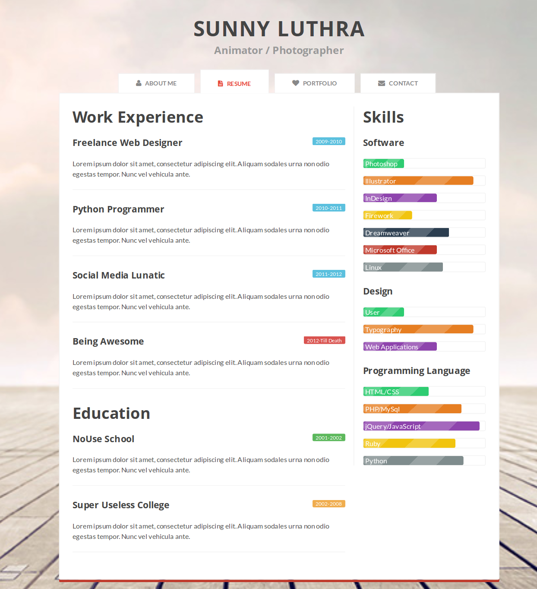

# Laborator 1 - [HTML] - Introducere

HTML sau `Hyper Text Markup Language` este limbajul de definire al continutului (text, imagini, etc.) paginilor web, ca in exemplul urmator:

```HTML
<!DOCTYPE html>
<html lang="en">
<head>
  <meta charset="UTF-8">
  <meta name="viewport" content="width=device-width, initial-scale=1.0">
  <meta http-equiv="X-UA-Compatible" content="ie=edge">
  <title>Document</title>
</head>
<body>
  <table border="0" cellpadding="10">
      <tr>
        <td>
          
        </td>
        <td>
          <h1>Sample "Hello, World" Application</h1>
        </td>
      </tr>
    </table>
    <p>This is the home page for the Web application. </p>
</body>
</html>
```

## Exercitiul 1.1

Creati un document HTML (*index.html*) cu descrierea personala (incluzand si o poza a voastra) folosind tagurile semantice cunoscute: ````,``<article>``, ``<section>``, ``<p>``, ``<h1>``, …, ``<h6>``, … .

## Exercitiul 1.2

Creati un document HTML (*cv.html*) cu CV-ul personal care va contine cel putin 2 sectiuni (Experienta profesionala, Educatie), cuprinzand o lista cu cel putin 3 elemente (pozitii ocupate, formele de invatamant absolvite, etc.). Totodata, adaugati si lista cu abilitati pe care le aveti in sectiunea ``<aside>`` a documentului.

### Exemplu de website care contine si CV-ul personal:


