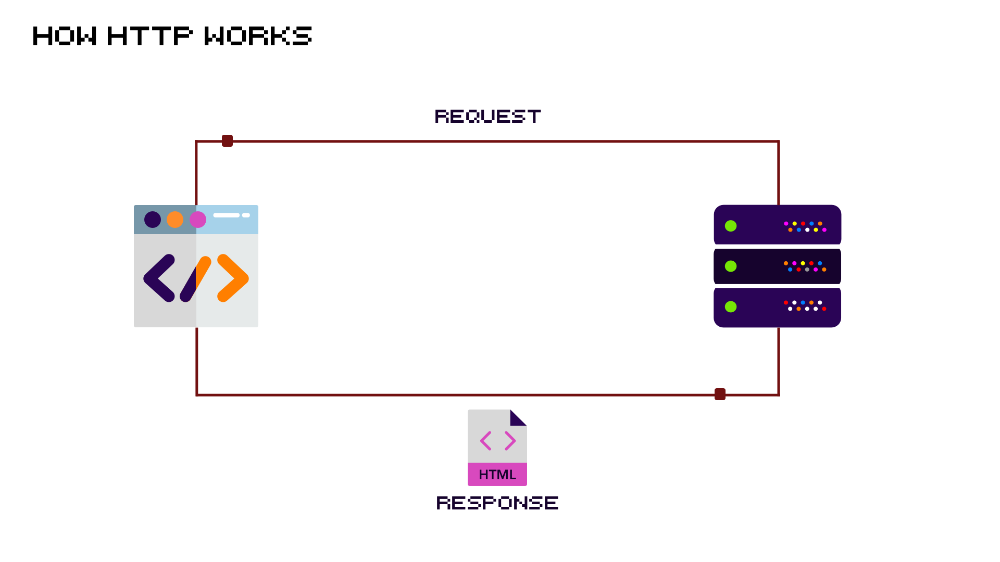
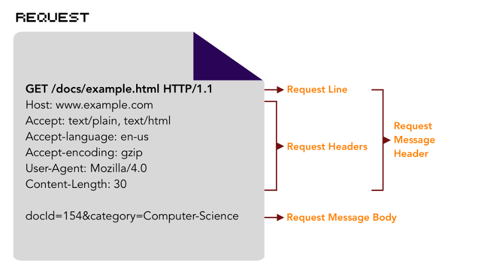
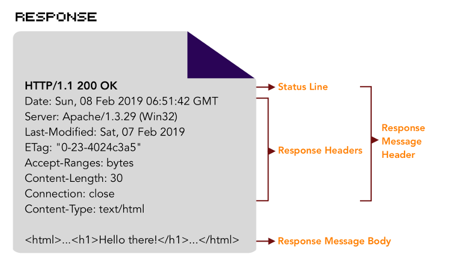
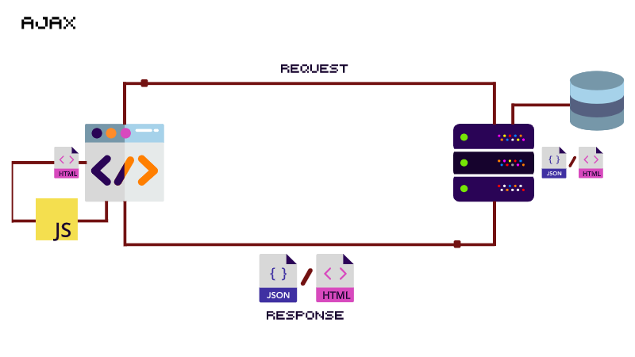

# Laborator 8 - [JS] - AJAX si randarea pe client- Partea intai

HTTP permite aplicatiilor web sa comunice intre ele si sa schimbe date fie ele text, imagini, videoclipuri, sunete sau documente.





AJAX este prescurtarea pentru Asynchronous JavaScript and XML (JavaScript si XML asincron) si reprezinta o colectie de tehnologii utilizate in dezvoltarea aplicatiilor web. AJAX presupune un schimb redus de date intre browser si server, astfel incat sa nu mai fie necesara reincarcarea intregii pagini web de fiecare data cand utilizatorul face o schimbare in continutul sau.



## Exercitiul 8.1

### My server

- Instalati [JSON Server](https://github.com/typicode/json-server) folosind comanda de mai jos:

```bash
npm install -g json-server
```

- Creati un fisier `db.json` cu continutul de mai jos:

```json
{
  "dogs": [
    {
      "id": 1,
      "name": "AFFENPINSCHER",
      "img": "https://images.dog.ceo/breeds/affenpinscher/n02110627_8099.jpg"
    },
    {
      "id": 2,
      "name": "AKITA",
      "img": "https://images.dog.ceo//breeds//akita//An_Akita_Inu_resting.jpg"
    },
    {
      "id": 3,
      "name": "CHIHUAHUA",
      "img": "https://images.dog.ceo/breeds/chihuahua/n02085620_7613.jpg"
    },
    {
      "id": 4,
      "name": "LHASA",
      "img": "https://images.dog.ceo/breeds/lhasa/n02098413_7358.jpg"
    },
    {
      "id": 5,
      "name": "HOUND",
      "img": "https://images.dog.ceo/breeds/hound-afghan/n02088094_2626.jpg"
    }
  ]
}
```

- Porniti JSON Server folosind comanda de mai jos:

```bash
json-server --watch db.json
```

- Accesand link-ul [http://localhost:3000/dogs](http://localhost:3000/dogs), veti vedea lista de catei:

```json
[
  {
    "id": 1,
    "name": "AFFENPINSCHER",
    "img": "https://images.dog.ceo/breeds/affenpinscher/n02110627_8099.jpg"
  },
  {
    "id": 2,
    "name": "AKITA",
    "img": "https://images.dog.ceo//breeds//akita//An_Akita_Inu_resting.jpg"
  },
  {
    "id": 3,
    "name": "CHIHUAHUA",
    "img": "https://images.dog.ceo/breeds/chihuahua/n02085620_7613.jpg"
  },
  {
    "id": 4,
    "name": "LHASA",
    "img": "https://images.dog.ceo/breeds/lhasa/n02098413_7358.jpg"
  },
  {
    "id": 5,
    "name": "HOUND",
    "img": "https://images.dog.ceo/breeds/hound-afghan/n02088094_2626.jpg"
  }
]
```

## Exercitiul 8.2

### Get all Dogs

- Creati un document HTML `index.html`.
- Creati un fisier JavaScript `script.js` si legati-l de documentul HTML folosind `<script>` la sfarsitul acestuia.
- Aduceti de la server lista de entitati _dog_ folosind [fetch](https://developers.google.com/web/updates/2015/03/introduction-to-fetch) - actiune de tip [GET](https://spring.io/understanding/REST#get).
- Creati dinamic si afisati lista de entitati in pagina (nume si imagine) folosind [createElement](https://developer.mozilla.org/en-US/docs/Web/API/Document/createElement).
