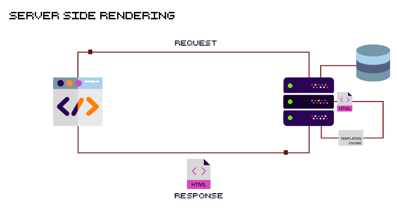

# Laborator 12 - [NodeJS] - Randare pe server (Server side rendering)

Randarea pe server a continutului unei pagini web a existat de la inceputul internetului, mai exact de cand au aparut primele servere web care puteau sa ruleze Java, PHP, Python sau Ruby.

## Exercitiul 12.1

Pentru a ne putea familiariza cu randarea pe server si totodata cu autentificarea prin sesiune, in laboratorul de astazi o sa rezolvam exercitiile din sectiunea _Advanced Node and Express Challenges_ de pe platforma [Free Code Camp](https://www.freecodecamp.org/learn/information-security-and-quality-assurance/advanced-node-and-express/).
