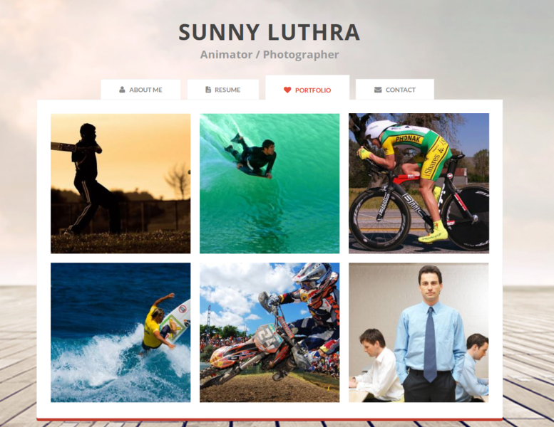
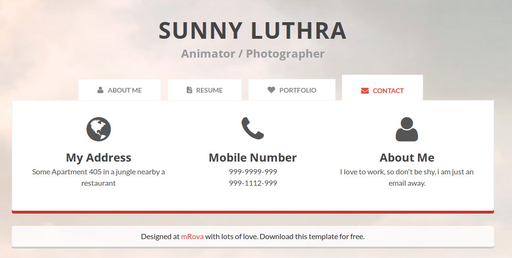

# Laborator 3 - [CSS] - Layout si Flexbox

Exercitiile din acest laborator reprezinta o continuare a exercitiilor din laboratorul trecut.
Pentru completarea exercitiilor folositi markup-ul si stilurile, de mai jos, in crearea paginilor.

```html
<!DOCTYPE html>
<html lang="en">
<head>
  <meta charset="UTF-8">
  <meta name="viewport" content="width=device-width, initial-scale=1.0">
  <meta http-equiv="X-UA-Compatible" content="ie=edge">
  <link href="https://fonts.googleapis.com/css?family=Open+Sans:400,700" rel="stylesheet">
  <link href="https://fonts.googleapis.com/css?family=Lato&display=swap" rel="stylesheet">
  <link rel="stylesheet" href="https://cdnjs.cloudflare.com/ajax/libs/normalize/7.0.0/normalize.min.css">

  <link rel="stylesheet" href="css/style.css">
  <link rel="stylesheet" href="css/portfolio-style.css">
  <title>Portfolio</title>
</head>
<body>
  <header class="header">
    <h1 class="title">SUNNY LUTHRA</h1>
    <h2 class="subtitle">Animator / Photographer</h2>
  </header>
  <nav class="menu menu--light">
    <a class="menu-item" href="index.html"><i class="fa fa-user"></i> About me</a>
    <a class="menu-item" href="resume.html"><i class="fa fa-file-text"></i> Resume</a>
    <a class="menu-item menu-item-active" href="portfolio.html"><i class="fa fa-heart"></i> Portfolio</a>
    <a class="menu-item" href="contact.html"><i class="fa fa-envelope"></i> Contact</a>
  </nav>
  <div class="page-grid">
    <main class="container portfolio-container">
      <!-- Adaugati aici markup-ul rezultat din rezolvarea exercitiilor -->
    </main>
    <footer class="footer">
      <p class="copyright">Designed with lots of love at mRova. </p>
    </footer>
  </div>
</body>

</html>
```

```CSS
* {
    box-sizing: border-box;
}

html {
    font-family: 'Open Sans', sans-serif;
    color: #555;
}

body {
    background: url('https://raw.githubusercontent.com/WebToLearn/personal-page-css-workshop/master/img/background.jpg');
    background-repeat: no-repeat;
    background-attachment: fixed;
    background-position: center center;
    background-size: cover;
}

p {
    font-family: 'Lato', sans-serif;
    line-height: 1.5em;
    margin: 0 0 1.5em 0;
}

.page-grid {
    margin: 0;
    display: grid;
    grid-template-columns: 1fr 990px 1fr;
    grid-template-areas:
        ". container ."
        ". footer .";
}

.container {
    grid-area: container;
    background: white;
    padding: 30px 20px;
    border: 1px solid #f1f1f1;
    box-shadow: 0px 6px #c0392b;
    border-radius: 0px 0px 4px 4px;
}

.footer {
    grid-area: footer;
    margin-top: 30px;
    margin-bottom: 10px;
    background: white;
    text-align: center;
    padding: 15px;
    box-shadow: 0px 4px #ccc;
    border-radius: 4px;
}

.copyright {
    margin: 0;
}

.menu {
    width: 990px;
    margin: 80px auto 0 auto;
    text-align: center;
}

.menu--light {
    margin: 30px auto 0 auto;
}

.menu-item {
    display: inline-block;
    margin-right: 10px;
    margin-top: 20px;
    padding: 10px 40px 10px 40px;
    background: white;
    text-decoration: none;
    font-weight: bold;
    text-transform: uppercase;
    font-size: 14px;
    outline: none;
    color: #888;
    vertical-align: bottom;
}
.menu-item-active {
    position: relative;
    bottom: -1px;
    color: #c0392b;
    padding: 15px 40px 15px 40px;
    margin-top: 0;
}

.title {
    margin: 0;
    font-size: 38px;
    font-weight: 700;
    text-transform: uppercase;
    text-align: center;
}

.subtitle {
    color: #999;
    font-size: 1.5em;
    line-height: 1em;
    margin: 0 0 1em 0;
    text-align: center;
}

.header {
    margin-top: 30px;
}

hr {
    margin: 25px 0;
    border: 1px solid #f1f1f1;
}

@media (max-width: 990px) {
    .menu {
        width: 100%;
    }
    .page-grid {
        display: block;
    }
    .footer {
        border-radius: 0;
    }
}

@media (max-width: 768px) {
    body {
        background: none;
    }
    .header {
        display: none;
    }
    .menu {
        margin: 0;
    }
    .menu-item {
        display: block;
        margin: 0;
        padding: 15px 40px 15px 40px;
        border-top: 1px solid #ccc;
    }
    .menu-item-active {
        position: static;
        margin: 0;
        padding: 15px 40px 15px 40px;
    }
    .footer {
        margin-top: 3px;
    }
}
/* Adaugati aici stiluri rezultate din rezolvarea exercitiilor */
```

## Exercitiul 3.1

[Flexbox froggy](https://flexboxfroggy.com/) ne ajuta sa invatam [Flexbox](https://css-tricks.com/snippets/css/a-guide-to-flexbox/). Hai sa ne jucam!

## Exercitiul 3.2

Creati un document HTML (_portfolio.html_) al carui layout va contine mai multe imagini (ca in exemplu). Putem folosi serviciul [picsum.photos](https://picsum.photos/) pentru URL-ul imaginilor:

- https://picsum.photos/seed/a/400/400"
- https://picsum.photos/seed/b/400/400"
- https://picsum.photos/seed/c/400/400"
- https://picsum.photos/seed/d/400/400"
- https://picsum.photos/seed/e/400/400"
- https://picsum.photos/seed/f/400/400"

Stilizati imaginile cu ajutorul [Flexbox-ului](https://css-tricks.com/snippets/css/a-guide-to-flexbox/) astfel incat sa respecte aspectul designul de mai jos.
Numarul de coloane folosit pentru afisarea imaginilor trebuie sa difere in functie de rezolutie:

- rezolutie mai mica de 768px - 1 coloana (telefon mobil)
- rezolutie mai mica de 990px - 2 coloane (tableta)
- rezolutie mai mare de 990px - 3 coloane (desktop)



## Exercitiul 3.3

Creati un document HTML (_contact.html_) si includeti libraria [Font Awesome](https://fontawesome.com/v4.7.0/get-started/) folosind-o pentru a afisa o iconita in pagina.

## Exercitiul 3.4

Completati si stilizati _contact.html_ pentru a arata ca in designul de mai jos:


